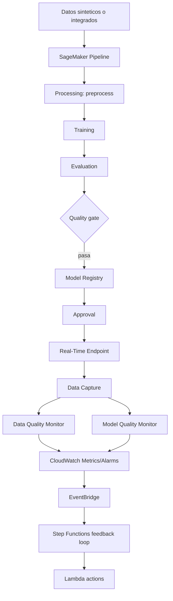

# Laboratorio 5 - MLOps en AWS Machine Learning

Este laboratorio implementa un flujo cloud de MLOps en AWS para industrializar el ciclo de vida de un modelo de Machine Learning: build, registry, approval, deployment, monitoring, alarmas y feedback loop gobernado.

## Objetivo

Construir una solucion reproducible que permita:

1. Preparar datos y entrenar un modelo en SageMaker.
2. Registrar el modelo en SageMaker Model Registry.
3. Aprobar o rechazar candidatos.
4. Desplegar solo modelos aprobados.
5. Habilitar Data Capture.
6. Crear baseline y Model Monitor schedule.
7. Detectar violations de data quality y publicar metricas.
8. Medir model quality con SageMaker Model Quality Monitor, output capture, ground truth e `InferenceId`.
9. Crear CloudWatch Alarms.
10. Enrutar eventos con EventBridge.
11. Ejecutar un feedback loop con Step Functions y Lambda.
12. Elegir una accion controlada: retraining, rollback, baseline update, human review o no action.

## Arquitectura general

`S3 -> Processing -> Training -> Evaluation -> Quality Gate -> Model Registry -> Approval -> Endpoint -> Data Capture -> Model Monitor -> CloudWatch -> EventBridge -> Step Functions -> Lambda actions`

La ruta de performance agrega un flujo nativo de Model Quality:

`Endpoint InvokeEndpoint + InferenceId -> Data Capture output -> delayed ground truth -> SageMaker ModelQuality schedule -> native CloudWatch metrics -> alarm`

Vista conceptual:



## Como leer este repositorio

El laboratorio esta construido como un sistema ejecutable, no como notebooks aislados. La fuente de verdad operacional esta en:

- `src/lab_runner.py`: orden de pasos y comandos que se ejecutan.
- `src/config.py`: variables, defaults, nombres de recursos y rutas S3.
- `.env.example`: plantilla editable para el usuario.
- `infra/cloudformation/template.yaml`: bucket y roles base.
- `artifacts/local_outputs/`: evidencia que cada script deja para auditoria y para pasos siguientes.

Los documentos en `lab/` siguen la misma estructura: objetivo, inputs, outputs, conceptos, flujo, paths, prerequisitos, comandos, validacion y troubleshooting.

## Servicios AWS usados

- Amazon S3.
- SageMaker Pipelines.
- SageMaker Processing Jobs.
- SageMaker Training Jobs.
- SageMaker Model Registry.
- SageMaker Model Package Group.
- SageMaker Endpoint.
- SageMaker Data Capture.
- SageMaker Model Monitor.
- CloudWatch Logs, Metrics y Alarms.
- EventBridge.
- Step Functions.
- Lambda.
- IAM con minimo privilegio.
- KMS opcional.
- CloudFormation para infraestructura base.

## Modos de ejecucion

### standalone_mode

Modo por defecto (`LAB_MODE=standalone`). No depende del laboratorio 4. Genera datos sinteticos, crea el pipeline completo, registra un modelo, despliega endpoint, configura monitoreo, alarmas y feedback loop.

### integrated_mode

Modo opcional (`LAB_MODE=integrated`). Reutiliza recursos si se configuran:

- `MODEL_PACKAGE_GROUP_NAME`
- `MODEL_PACKAGE_ARN`
- `MODEL_ARTIFACT_S3_URI`
- `MODEL_IMAGE_URI`
- `ENDPOINT_NAME`
- `FEATURE_GROUP_NAME`
- `FEATURE_CONTRACT_S3_URI`
- `SAGEMAKER_EXECUTION_ROLE_ARN`
- `DATA_CAPTURE_S3_URI`

Los recursos externos no se eliminan por defecto durante cleanup.

Si reutilizas un artefacto de modelo sin `MODEL_PACKAGE_ARN`, configura tambien `MODEL_IMAGE_URI` para que SageMaker pueda crear el modelo.

## Independencia del laboratorio 4

La ruta `standalone_mode` crea sus propios datos, modelo, registry, endpoint y monitoreo. Por eso el laboratorio 5 puede ejecutarse aunque ningun recurso anterior exista. `integrated_mode` solo mejora la experiencia cuando hay recursos previos.

## Reejecuciones y nombres de recursos

El laboratorio esta disenado para reejecutarse con nombres estables para los recursos principales del ambiente. Esto facilita encontrar los recursos en consola y hacer cleanup, pero significa que no todos los nombres son unicos en cada corrida.

| Recurso | Nombre por defecto | Comportamiento al reejecutar |
|---|---|---|
| CloudFormation stack | `mlops-lab-stack` | Se crea o actualiza. |
| S3 bucket | output de CloudFormation | Se reutiliza. |
| SageMaker Pipeline | `mlops-build-pipeline` | Se actualiza; cada execution ARN es unico. |
| Model Package Group | `mlops-model-package-group` | Se reutiliza; cada Model Package version es unica (`/1`, `/2`, `/3`, ...). |
| Processing/Training Jobs del pipeline | generado por SageMaker | Unicos por execution. |
| Endpoint real-time | `mlops-lab-endpoint` | Se reutiliza o reemplaza si el modelo/configuracion cambia. |
| Endpoint config | `mlops-lab-endpoint-config` | Se reemplaza cuando es necesario. |
| SageMaker Model del endpoint | `mlops-lab-endpoint-model` | Se reemplaza cuando apunta a otro model package o artefacto. |
| Baseline Processing Job | `mlops-lab-baseline-<timestamp>` | Unico por timestamp. |
| Monitoring schedule | `mlops-monitoring-schedule` | Se reutiliza o recrea; si AWS bloquea el nombre puede usar un fallback con timestamp. |
| Data Quality Alarm | `mlops-data-quality-alarm` | Se actualiza cuando la ruta nativa esta disponible. |
| Custom Data Quality Alarm | `mlops-custom-data-quality-alarm` | Se actualiza cuando el fallback custom esta activo. |
| Custom Batch Data Quality Alarm | `mlops-custom-batch-data-quality-alarm` | Se actualiza cuando el fallback custom batch esta activo. |
| Model Quality Alarm | `mlops-model-quality-alarm` | Se actualiza. |
| Custom Model Quality schedule | `mlops-custom-model-quality-schedule` | Se crea solo como fallback o con `--force`. |
| Custom Model Quality Alarm | `mlops-custom-model-quality-alarm` | Se actualiza. |
| EventBridge rule | `mlops-lab-alarm-to-feedback-loop` | Se actualiza. |
| SNS topic | `mlops-lab-alarm-notifications` | Se reutiliza; la suscripcion email requiere confirmacion. |
| Step Functions state machine | `mlops-feedback-loop` | Se actualiza. |
| Lambda functions | `mlops-lab-*` | Se actualizan. |
| Batch Transform Job | `mlops-lab-batch-<timestamp>` | Unico por timestamp. |

Para repetir la practica en el mismo ambiente, usa `python -m src.lab_runner cleanup` o los `destroy-*` antes de empezar si quieres limpiar endpoint, schedules, alarmas, feedback loop, pipeline, jobs terminales y artefactos S3 del laboratorio. Para una corrida realmente aislada, por ejemplo si quieres comparar dos laboratorios en paralelo o evitar mezclar objetos S3 anteriores, cambia tambien los nombres principales en `.env`:

```env
RESOURCE_PREFIX=mlops-lab-enrique
ENVIRONMENT=run01
PIPELINE_NAME=mlops-build-pipeline-run01
MODEL_PACKAGE_GROUP_NAME=mlops-model-package-group-run01
ENDPOINT_NAME=mlops-lab-endpoint-run01
MONITORING_SCHEDULE_NAME=mlops-monitoring-schedule-run01
ALARM_NAME=mlops-data-quality-alarm-run01
CUSTOM_DATA_QUALITY_ALARM_NAME=mlops-custom-data-quality-alarm-run01
CUSTOM_BATCH_DATA_QUALITY_ALARM_NAME=mlops-custom-batch-data-quality-alarm-run01
STATE_MACHINE_NAME=mlops-feedback-loop-run01
```

Si solo cambias `RESOURCE_PREFIX` o `ENVIRONMENT`, los prefijos S3 y varios recursos auxiliares cambian, pero `PIPELINE_NAME`, `MODEL_PACKAGE_GROUP_NAME`, `ENDPOINT_NAME`, `MONITORING_SCHEDULE_NAME`, `ALARM_NAME`, `CUSTOM_DATA_QUALITY_ALARM_NAME`, `CUSTOM_BATCH_DATA_QUALITY_ALARM_NAME` y `STATE_MACHINE_NAME` siguen usando sus defaults salvo que los declares explicitamente.

## Prerrequisitos

- AWS CLI configurado.
- Python 3.11+ o 3.12.
- Permisos para SageMaker, S3, IAM, Lambda, Step Functions, CloudWatch y EventBridge.
- Un bucket S3 o permiso para crearlo con CloudFormation.
- Roles IAM creados por `infra/cloudformation/template.yaml` o equivalentes.

## Flujo secuencial recomendado

| Paso | Comando | Que produce | Paso que lo consume |
|---|---|---|---|
| 01 | `python -m src.lab_runner step 01` | `.env.cloud`, bucket, roles | Todos los pasos cloud. |
| 02 | `python -m src.lab_runner step 02` | Datos locales y S3 raw | Pipeline, trafico normal/drift. |
| 05 | `python -m src.lab_runner step 05` | Pipeline ejecutado, model package | Registry y approval. |
| 06 | `python -m src.lab_runner step 06` | Modelo aprobado | Deploy. |
| 07 | `python -m src.lab_runner step 07` | Endpoint InService | Data Capture y monitoreo. |
| 08 | `python -m src.lab_runner step 08` | Capturas Input/Output | Data Quality y Model Quality. |
| 09 | `python -m src.lab_runner step 09` | Model Quality baseline/schedule/alarms | Feedback y readiness. |
| 10 | `python -m src.lab_runner step 10` | Data Quality baseline, schedule/fallback, drift, metrica y alarma | Feedback y readiness. |
| 11 | `python -m src.lab_runner step 11` | Step Functions, Lambdas, SNS, EventBridge | Simulacion y cierre. |
| 12 | `python -m src.lab_runner step 12` | Batch Transform y monitoreo batch opcional | Evidencia batch. |
| 13 | `python -m src.lab_runner step 13` | Reporte final y readiness | Evidencia de entrega antes de cleanup. |
| 14 | `python -m src.lab_runner step 14` | Plan de costos, seguridad y cleanup | Cierre operativo. |

El paso 13 genera el reporte/readiness antes del cleanup. El paso 14 documenta costos, seguridad, rollback, baseline update y cleanup. Ejecuta `python -m src.lab_runner cleanup` solo cuando quieras destruir recursos cloud y artefactos S3 del lab. El paso 12 sigue siendo opcional dentro de `all` para evitar lanzar jobs batch extra sin pedirlo explicitamente.

## Matriz de configuracion modificable

| Necesidad | Variable en `.env` | Comentario |
|---|---|---|
| Cambiar region | `AWS_REGION` | Requiere que las imagenes SageMaker y cuotas existan en esa region. |
| Usar otro bucket | `S3_BUCKET_NAME` | Si queda vacio, CloudFormation puede crear uno. |
| Cambiar nombres para corrida aislada | `RESOURCE_PREFIX`, `ENVIRONMENT`, `PIPELINE_NAME`, `ENDPOINT_NAME`, `MODEL_PACKAGE_GROUP_NAME` | Evita mezclar recursos con corridas previas. |
| Ajustar compute | `AUTO_SELECT_COMPUTE`, `*_INSTANCE_TYPE_CANDIDATES` | El selector consulta Service Quotas por workload. |
| Endurecer quality gate | `F1_THRESHOLD`, `AUC_THRESHOLD` | Afecta registro del modelo. |
| Cambiar frecuencia de monitoreo | `MONITORING_CRON_EXPRESSION`, `MODEL_QUALITY_MONITORING_CRON_EXPRESSION` | SageMaker Model Monitor exige minuto `0` en cron. |
| Probar fallback custom MQ | `CUSTOM_MODEL_QUALITY_CRON_EXPRESSION`, `CUSTOM_MODEL_QUALITY_WINDOW_HOURS` | EventBridge cron + Lambda + Processing Job. |
| Probar fallback custom batch | `CUSTOM_BATCH_DATA_QUALITY_CRON_EXPRESSION`, `CUSTOM_BATCH_DATA_QUALITY_ALARM_NAME`, `BATCH_VIOLATIONS_METRIC_NAME` | EventBridge cron + Lambda + Processing Job sobre input batch en S3. |
| Cambiar email de alarma | `ALARM_EMAIL` | SNS requiere confirmacion manual del correo. |
| Permitir retraining automatico | `ENABLE_AUTOMATIC_RETRAINING=true` | Por defecto esta desactivado como guardrail. |

## Setup

```bash
python -m venv .venv
source .venv/bin/activate
pip install -r requirements.txt
```

Windows PowerShell:

```powershell
python -m venv .venv
.venv\Scripts\Activate.ps1
pip install -r requirements.txt
```

Copiar variables:

```bash
cp .env.example .env
```

Completar como minimo:

- `AWS_REGION`
- `AWS_PROFILE`, si no usas credenciales del entorno

`S3_BUCKET_NAME` y los roles pueden quedar vacios al inicio. El paso numerado `01` crea o valida la base cloud y escribe los outputs en `.env.cloud`, que se carga automaticamente junto con `.env`.

## Infraestructura

La ruta recomendada es ejecutar el paso numerado:

```bash
python -m src.lab_runner step 01
```

Ese paso valida credenciales, despliega roles y bucket opcional, y vuelve a validar la configuracion final.

Comando directo equivalente para solo infraestructura:

```bash
make deploy-infra
```

Comandos equivalentes:

```bash
python -m src.deploy_infra
bash scripts/deploy_infra.sh
```

Windows PowerShell:

```powershell
.\scripts\deploy_infra.ps1
```

`make deploy-infra` es solo un wrapper. El comando principal es `python -m src.deploy_infra`, y ya esta incluido dentro de `python -m src.lab_runner step 01`.

Si `S3_BUCKET_NAME` esta vacio, CloudFormation crea un bucket privado del laboratorio. Los outputs quedan en `.env.cloud`:

- `S3_BUCKET_NAME`
- `SAGEMAKER_EXECUTION_ROLE_ARN`
- `LAMBDA_EXECUTION_ROLE_ARN`
- `STEPFUNCTIONS_ROLE_ARN`
- `EVENTBRIDGE_TO_SFN_ROLE_ARN`

Tambien puedes omitir CloudFormation si ya tienes recursos existentes. Para eso completa manualmente en `.env`:

```env
S3_BUCKET_NAME=tu-bucket-privado
SAGEMAKER_EXECUTION_ROLE_ARN=arn:aws:iam::<account-id>:role/<sagemaker-role>
LAMBDA_EXECUTION_ROLE_ARN=arn:aws:iam::<account-id>:role/<lambda-role>
STEPFUNCTIONS_ROLE_ARN=arn:aws:iam::<account-id>:role/<stepfunctions-role>
EVENTBRIDGE_TO_SFN_ROLE_ARN=arn:aws:iam::<account-id>:role/<eventbridge-role>
```

## Model build pipeline

Pipeline implementado:

`process -> train -> evaluate -> quality gate -> register`

Comandos:

```bash
make data
make check-compute
make check-batch-transform-compute
make build-pipeline
make run-build-pipeline
```

El quality gate valida `F1 >= 0.70` y `AUC >= 0.70` por defecto.

`check-compute` consulta Service Quotas para elegir una instancia disponible para Processing, Training, Endpoint y Batch Transform. En SageMaker, la inferencia batch se implementa con Batch Transform; no es un endpoint persistente como el endpoint real-time. Por defecto usa candidatos inspirados en el laboratorio 4:

```env
PROCESSING_INSTANCE_TYPE_CANDIDATES=ml.t3.medium,ml.t3.large,ml.m6i.large,ml.m5.xlarge,ml.m5.large,ml.c6i.xlarge,ml.c5.xlarge
MODEL_MONITOR_PROCESSING_INSTANCE_TYPE_CANDIDATES=ml.m6i.large,ml.m5.xlarge,ml.c6i.xlarge,ml.c5.xlarge,ml.t3.large,ml.t3.medium
TRAINING_INSTANCE_TYPE_CANDIDATES=ml.m6i.large,ml.m5.xlarge,ml.m5.large,ml.c6i.xlarge,ml.c5.xlarge
INSTANCE_TYPE_CANDIDATES=ml.c6i.large,ml.m6i.large,ml.m5.large,ml.m5.xlarge
BATCH_TRANSFORM_INSTANCE_TYPE_CANDIDATES=ml.c6i.large,ml.m6i.large,ml.m5.xlarge,ml.m5.large,ml.c6i.xlarge,ml.c5.xlarge
```

Si una cuenta tiene cuota 0 para `ml.m5.large for processing job usage`, el pipeline intentara seleccionar el siguiente candidato valido con cuota disponible. Nota: `ml.c6i.large` es valido para endpoints, pero no para Processing Jobs; para jobs se usa `ml.c6i.xlarge`.

Para Training Jobs, el laboratorio requiere cuota positiva visible. Si Service Quotas devuelve `unknown`, el selector no usa ese tipo automaticamente porque SageMaker puede rechazarlo despues de varios minutos con errores como `training-job/ml.t3.medium is not available in this region`.

Algunas cuentas de laboratorio reportan cuota 0 aunque existan Training Jobs recientes completados. En ese caso el selector revisa los ultimos Training Jobs `Completed` y puede usar ese historial como fallback best-effort, por ejemplo si encuentra un job reciente en `ml.m5.large`. Esto no garantiza capacidad futura; si SageMaker vuelve a rechazar el job, solicita aumento de cuota.

Para revisar solo Training:

```bash
python -m src.compute --workload training
python -m src.compute --workload training --inventory --limit 0
make check-training-compute
make check-training-inventory
```

Para revisar solo Batch Transform:

```bash
python -m src.compute --workload batch-transform
make check-batch-transform-compute
```

El resultado individual se guarda en `artifacts/local_outputs/compute_selection_batch_transform.json`.

Ese comando revisa solo los candidatos configurados. Para inspeccionar todos los tipos soportados por la API de SageMaker para Batch Transform y ver sus cuotas:

```bash
python -m src.compute --workload batch-transform --inventory --limit 0
make check-batch-transform-inventory
```

El inventario se guarda en `artifacts/local_outputs/compute_inventory_batch_transform.json` e incluye instancias con cuota positiva, cuota cero y cuota desconocida.

## Model Registry y approval gates

```bash
make approve-model
make reject-model
```

El deploy se bloquea si no existe un modelo `Approved`.

El paso de approval consulta el artefacto `evaluation.json` registrado en `ModelMetrics.ModelQuality.Statistics.S3Uri` y copia `accuracy`, `f1` y `auc` a `CustomerMetadataProperties` del Model Package como `metric_accuracy`, `metric_f1` y `metric_auc`. Esto facilita validar las metricas aunque SageMaker Studio no renderice el JSON arbitrario en la pestana Performance.

## Deployment pipeline

```bash
make deploy-model
make smoke-test
```

El endpoint real-time genera costo mientras este activo. No dejarlo corriendo si no se usa.

El deploy crea el SageMaker Model con `Image`, `ModelDataUrl` y variables de entorno de inferencia (`SAGEMAKER_PROGRAM=inference.py`, `SAGEMAKER_SUBMIT_DIRECTORY=s3://.../inference.tar.gz`). Esto es necesario para que el contenedor preconstruido de scikit-learn sepa que modulo importar durante `/ping` e invocaciones. Si un endpoint anterior quedo en `Failed`, el paso 07 reemplaza los recursos del laboratorio y vuelve a crearlos con el contrato correcto.

Estas variables se inspeccionan en el **SageMaker Model**, no en el Endpoint directamente. El Endpoint usa un Endpoint Config, y el Endpoint Config referencia el Model. Para verlo:

```bash
aws sagemaker describe-model \
  --model-name mlops-lab-endpoint-model \
  --query "PrimaryContainer.{Image:Image,ModelDataUrl:ModelDataUrl,Environment:Environment}" \
  --profile <AWS_PROFILE> \
  --region <AWS_REGION>
```

En consola: `SageMaker AI > Deployments & inference > Models > mlops-lab-endpoint-model`, en la seccion de container/environment variables.

## Data Capture

```bash
make enable-data-capture
make check-data-capture
```

La captura se escribe en `DATA_CAPTURE_S3_URI` o en el prefijo generado bajo `s3://bucket/mlops-lab/lab/data-capture/`.

Para habilitar el flujo nativo de Model Quality Monitor, el laboratorio captura `Input` y `Output` por defecto:

```env
CAPTURE_ENDPOINT_OUTPUT=true
```

Data Quality Monitor sigue comparando las features de entrada contra el baseline. Model Quality Monitor necesita ademas la prediccion capturada, `InferenceId` y ground truth posterior. Por eso la respuesta del endpoint se serializa como JSON compatible con `prediction` y `probability`.

Para el schedule nativo de Model Quality, esos campos se referencian como JSONPath: `$.prediction` y `$.probability`. Como el endpoint ya devuelve una clase discreta en `prediction`, el lab no envia `ProbabilityThresholdAttribute` en el schedule.

En SageMaker Studio nuevo puede no existir una pestana separada llamada `Data Capture` dentro del endpoint. Valida la captura con `DescribeEndpoint`, `DescribeEndpointConfig` y archivos `.jsonl` en S3. El paso `08` ejecuta `src.check_data_capture --wait` para esperar evidencia real en S3 y guardar `artifacts/local_outputs/data_capture_check.json`.

## Model Quality y performance monitoring

```bash
python -m src.lab_runner step 09
make model-quality
```

El paso 09 usa el flujo nativo de SageMaker Model Quality Monitor. Para eso el endpoint debe capturar output, cada invocacion debe llevar `InferenceId`, y el ground truth debe subirse luego con el mismo identificador.

El endpoint se despliega en el paso 07 y se valida en el paso 08. El paso 09 no lo recrea por defecto; valida el endpoint existente con `src.validate_model_quality_endpoint` y falla temprano si no captura `Input` y `Output`.

El paso 09 implementa este contrato:

```text
InvokeEndpoint con InferenceId
-> Data Capture Input/Output
-> S3 model-quality/ground-truth/yyyy/mm/dd/hh
-> SageMaker ProcessingJob de baseline Model Quality
-> S3 model-quality/baseline/constraints.json
-> SageMaker MonitoringSchedule MonitoringType=ModelQuality
-> CloudWatch native model quality metrics
-> mlops-model-quality-alarm
```

Si SageMaker devuelve `InternalFailure` al crear el schedule nativo, el lab prepara un fallback:

```text
EventBridge cron
-> Lambda mlops-custom-model-quality-trigger
-> SageMaker ProcessingJob custom
-> processing/custom_model_quality.py
-> CloudWatch custom metric MLOps/Lab / ModelQualityF1
-> mlops-custom-model-quality-alarm
```

Comandos individuales:

```bash
python -m src.configure_data_capture
python -m src.validate_model_quality_endpoint
python -m src.capture_model_quality_data --traffic-type normal --limit 50
python -m src.generate_model_quality_baseline --wait
python -m src.create_model_quality_schedule
python -m src.create_custom_model_quality_schedule --if-native-unavailable
python -m src.create_model_quality_alarm
python -m src.create_custom_model_quality_alarm
```

Para evaluar trafico con drift:

```bash
python -m src.capture_model_quality_data --traffic-type drift --limit 50
python -m src.generate_model_quality_baseline --wait
python -m src.create_model_quality_schedule
```

SageMaker publica metricas nativas en `aws/sagemaker/Endpoints/model-metrics`, con dimensiones `Endpoint` y `MonitoringSchedule`. Para clasificacion binaria, la alarma usa la metrica `f1`.

Como SageMaker Python SDK v3 no expone `sagemaker.model_monitor.ModelQualityMonitor`, el laboratorio crea el schedule con boto3 low-level y una definicion inline, equivalente al flujo de los notebooks de SDK v2. Si el analyzer devuelve constraints de Data Quality en vez de `binary_classification_constraints`, el lab sintetiza `statistics.json` y `constraints.json` de Model Quality a partir de `prediction`, `probability` y `label`.

En produccion, el baseline de Model Quality puede venir de predicciones sobre un holdout/test set etiquetado, una validacion offline o una ventana inicial de produccion con labels confirmados. En el laboratorio se construye desde 50 invocaciones reales al endpoint y labels sinteticos conocidos.

La alarma `mlops-model-quality-alarm` dispara si la metrica nativa `f1` cae por debajo de `MODEL_QUALITY_F1_THRESHOLD`. La alarma `mlops-custom-model-quality-alarm` dispara si la metrica custom `ModelQualityF1` cae por debajo del mismo umbral. EventBridge escucha ambas alarmas junto con `mlops-data-quality-alarm` y `mlops-custom-data-quality-alarm` cuando ejecutas el paso 11.

Para ejecutar manualmente el fallback custom:

```bash
python -m src.start_custom_model_quality_job --wait
```

`CUSTOM_MODEL_QUALITY_CRON_EXPRESSION` es un cron de EventBridge; para ejecucion inmediata del fallback custom usa el comando manual anterior, no `NOW`.

Para simular una degradacion y probar CloudWatch/EventBridge/SNS:

```bash
python -m src.simulate_model_quality_alarm --wait
```

Ese comando escribe ground truth adverso con `--label-mode opposite-prediction`; se debe usar solo para probar alarmas.

Outputs principales:

- `artifacts/local_outputs/model_quality_capture.json`
- `artifacts/local_outputs/model_quality_endpoint_validation.json`
- `artifacts/local_outputs/model_quality_baseline.json`
- `artifacts/local_outputs/model_quality_schedule.json`
- `artifacts/local_outputs/custom_model_quality_schedule.json`
- `artifacts/local_outputs/model_quality_alarm.json`
- `artifacts/local_outputs/custom_model_quality_alarm.json`
- `artifacts/local_outputs/model_quality_alarm_simulation.json`

## Model Monitor

```bash
make create-baseline
make create-monitoring-schedule
make simulate-traffic
make simulate-drift
make check-monitoring
python -m src.create_custom_data_quality_schedule --if-native-unavailable
python -m src.start_custom_data_quality_job --wait
python -m src.simulate_data_quality_alarm --wait
```

Revisar en S3:

- `statistics.json`
- `constraints.json`
- `constraints_violations.json`

El laboratorio usa boto3 low-level para baseline y schedules porque SageMaker Python SDK 3 ya no expone `sagemaker.model_monitor`. Para `us-east-1`, el schedule usa la imagen preconstruida `156813124566.dkr.ecr.us-east-1.amazonaws.com/sagemaker-model-monitor-analyzer`. En otras regiones puedes definir `MODEL_MONITOR_IMAGE_URI`.

El baseline cloud real tambien usa esa imagen preconstruida para generar `statistics.json` y `constraints.json` en el schema oficial. `src.generate_baseline` prepara `baseline_monitor.csv` con `record_id` y features, sin `churned`, para que coincida con el input capturado del endpoint.

La imagen de Model Monitor es Spark-based y puede tardar mucho en `ml.t3.medium`. Por eso baseline y schedule usan candidatos separados de los Processing Jobs del pipeline:

```env
MODEL_MONITOR_PROCESSING_INSTANCE_TYPE=ml.m6i.large
MODEL_MONITOR_PROCESSING_INSTANCE_TYPE_CANDIDATES=ml.m6i.large,ml.m5.xlarge,ml.c6i.xlarge,ml.c5.xlarge,ml.t3.large,ml.t3.medium
```

Si tu cuenta solo tiene cuota para `ml.t3.medium`, el job puede tardar cerca del `MaxRuntimeInSeconds` del Processing Job. Puedes revisar o detener un baseline en curso con:

```bash
aws sagemaker describe-processing-job --processing-job-name <job-name> --profile <profile> --region <region>
aws sagemaker stop-processing-job --processing-job-name <job-name> --profile <profile> --region <region>
```

Si un monitoring job falla con `No usable value for version`, el schedule esta leyendo un `constraints.json` antiguo o con formato no compatible. Ejecuta:

```bash
python -m src.lab_runner step 10
```

y espera al siguiente periodo del schedule.

La frecuencia se controla con:

```env
MONITORING_CRON_EXPRESSION=cron(0 * ? * * *)
```

SageMaker Model Monitor soporta schedules horarios, diarios, `NOW` y tasas horarias enteras entre 1 y 24 horas. En los cron nativos de Model Monitor, el minuto debe ser `0`. El fallback custom de Data Quality usa EventBridge cron y se ejecuta manualmente con `python -m src.start_custom_data_quality_job --wait`. El fallback custom de Model Quality se ejecuta manualmente con `python -m src.start_custom_model_quality_job --wait`. El fallback custom batch se ejecuta manualmente con `python -m src.start_custom_batch_data_quality_job --wait`.

Ejemplos validos:

```env
MONITORING_CRON_EXPRESSION=cron(0 * ? * * *)
MONITORING_CRON_EXPRESSION=cron(0 12 ? * * *)
MONITORING_CRON_EXPRESSION=cron(0 0/2 ? * * *)
```

No hay schedule nativo de Model Monitor para minuto 45 ni para exactamente cada 45 minutos. Para ese caso usa EventBridge Scheduler o Lambda lanzando jobs custom. Si cambias el cron, `src.create_monitoring_schedule` recrea el schedule si detecta una configuracion distinta.

Si un monitoring execution falla con `Encoding mismatch: Encoding is JSON for endpointInput, but Encoding is BASE64 for endpointOutput`, valida primero el endpoint existente:

```bash
python -m src.validate_model_quality_endpoint
```

Si el endpoint/configuracion viene de una version antigua del laboratorio, recrealo con el contrato JSON actual:

```bash
python -m src.deploy_model --wait --force-recreate
```

`--force-recreate` elimina primero los monitoring schedules del laboratorio asociados al endpoint, porque SageMaker puede bloquear `DeleteEndpoint` si existen schedules asociados. Ejecuta luego el paso `09` y, si aplica, los pasos `10` y `11` para recrear baseline/schedule de Data Quality.

Si `CreateMonitoringSchedule` devuelve `InternalFailure` de forma repetida despues de una recreacion, el script reintenta y puede usar automaticamente un nombre con sufijo timestamp. El nombre real queda en `artifacts/local_outputs/monitoring_schedule.json` como `actual_monitoring_schedule_name`, y el cleanup lo elimina junto con el nombre configurado.

Si SageMaker sigue respondiendo `InternalFailure` incluso con nombre nuevo, el laboratorio intenta crear un `DataQualityJobDefinition` y programar desde esa definicion. Si esa segunda ruta tambien falla, se registra `status=native_schedule_unavailable`, `src.create_custom_data_quality_schedule --if-native-unavailable` crea una ruta EventBridge -> Lambda -> Processing Job, y `src.check_monitoring_results` mantiene una evidencia fallback local/S3 para que la practica pueda continuar. Esa ruta fallback no reemplaza al schedule nativo en produccion; evita que un error opaco del plano de control bloquee el resto del laboratorio.

Para probar la ruta custom de Data Quality y la alarma de drift sin esperar al cron:

```bash
python -m src.simulate_data_quality_alarm --wait
```

Ese comando envia trafico drifted, ejecuta el Processing Job custom sobre `inference_drift.jsonl`, escribe reportes en `s3://.../monitoring/custom/reports/` y publica `MLOps/Lab / DataQualityViolations`. Como el paso 10 crea la alarma activa de Data Quality, `mlops-custom-data-quality-alarm` debe pasar a `ALARM` cuando el fallback esta activo y el conteo es mayor o igual a `ALARM_THRESHOLD`. Si la ruta nativa esta activa, revisa `mlops-data-quality-alarm`.

Cuando veas `status=native_schedule_unavailable`, interpreta la consola asi: el baseline existe, el endpoint/Data Capture existe y las violations fallback existen, pero el **Monitoring Schedule nativo no existe** porque SageMaker devolvio `InternalFailure` antes de crearlo. Por eso SageMaker Studio puede mostrar vacia la seccion `Monitor schedule`. Para ese caso, diagnostica con CloudTrail (`CreateMonitoringSchedule` y `CreateDataQualityJobDefinition`); CloudWatch Processing logs solo existen cuando una execution ya creo un `ProcessingJobArn`.

## Batch Transform y monitoreo batch

SageMaker no tiene un "batch endpoint" persistente como un endpoint real-time. La ruta batch se implementa con **SageMaker Batch Transform**:

```text
S3 batch input -> Batch Transform Job -> S3 predictions -> BatchDataCaptureConfig -> S3 captured data -> BatchTransformInput -> Model Monitor
```

El paso batch es opcional y no se ejecuta dentro de `all-cloud` para evitar lanzar jobs adicionales sin pedirlo explicitamente.

```bash
python -m src.lab_runner step 12
```

Comandos individuales:

```bash
make check-batch-transform-compute
make run-batch-transform
make check-batch-transform-capture
make create-batch-monitoring-schedule
make create-custom-batch-data-quality-schedule
make run-custom-batch-data-quality
make create-batch-alarm
```

En batch, la captura no aparece como Data Capture del endpoint. Se valida en S3 bajo:

- `mlops-lab/lab/batch-transform/output/`
- `mlops-lab/lab/batch-transform/data-capture/`

El schedule batch usa `BatchTransformInput.DataCapturedDestinationS3Uri` y puede compartir el baseline del paso 10 si el contrato de features es el mismo. Si el batch procesa otra poblacion o esquema, crea un baseline separado antes de monitorear.

Si SageMaker no crea el schedule nativo batch, el paso 12 prepara un fallback custom:

```text
EventBridge cron -> Lambda -> SageMaker Processing Job -> processing/custom_data_quality.py
-> MLOps/Lab / BatchDataQualityViolations -> mlops-custom-batch-data-quality-alarm
```

Ese fallback evalua el JSONL batch de entrada (`BATCH_TRANSFORM_INPUT_S3_URI`) contra `baseline_monitor.csv`. Para probar alarma batch con datos drifted:

```bash
python -m src.simulate_batch_data_quality_alarm --wait
```

## CloudWatch

```bash
make create-alarm
make create-model-quality-alarm
make create-custom-model-quality-alarm
make create-batch-alarm
```

La alarma de Data Quality usa la metrica custom `MLOps/Lab / DataQualityViolations`.
La alarma custom batch usa la metrica custom `MLOps/Lab / BatchDataQualityViolations`. Se puede crear aunque el schedule nativo batch exista, porque tambien sirve para probar manualmente la ruta `BatchDataQualityViolations -> CloudWatch Alarm -> EventBridge -> SNS/Step Functions` con `python -m src.simulate_batch_data_quality_alarm --wait`.
La alarma de performance usa la metrica nativa `aws/sagemaker/Endpoints/model-metrics / f1`.
La alarma fallback de performance usa la metrica custom `MLOps/Lab / ModelQualityF1`.

Donde revisar la configuracion en codigo:

- `src/config.py`: defaults y variables de entorno para namespace, metric name y parametros de alarma.
- `monitoring/publish_custom_metric.py`: publica `DataQualityViolations` con dimension `EndpointName`.
- `src/check_monitoring_results.py`: lee `constraints_violations.json` y publica el conteo.
- `src/create_cloudwatch_alarm.py`: crea la alarma activa de Data Quality: `mlops-data-quality-alarm` para ruta nativa o `mlops-custom-data-quality-alarm` para fallback custom.
- `processing/custom_data_quality.py`: calcula violations de Data Quality dentro del Processing Job custom.
- `src/create_custom_data_quality_schedule.py`: crea EventBridge cron + Lambda trigger para el Processing Job custom de Data Quality.
- `src/simulate_data_quality_alarm.py`: ejecuta drift + job custom para probar `mlops-custom-data-quality-alarm`.
- `src/create_custom_batch_data_quality_schedule.py`: crea EventBridge cron + Lambda trigger para fallback batch.
- `src/start_custom_batch_data_quality_job.py`: evalua el JSONL batch contra el baseline y publica `BatchDataQualityViolations`.
- `src/create_batch_cloudwatch_alarm.py`: crea `mlops-custom-batch-data-quality-alarm`.
- `src/simulate_batch_data_quality_alarm.py`: prueba la alarma batch con `inference_drift.jsonl`.
- `src/generate_model_quality_baseline.py`: crea `statistics.json` y `constraints.json` para el schedule nativo de Model Quality.
- `src/create_model_quality_schedule.py`: crea el schedule nativo `ModelQuality` con definicion inline y fallback por job definition.
- `src/create_model_quality_alarm.py`: crea `mlops-model-quality-alarm` sobre la metrica nativa `f1`.
- `processing/custom_model_quality.py`: calcula metricas de Model Quality dentro del Processing Job custom.
- `src/create_custom_model_quality_schedule.py`: crea EventBridge cron + Lambda trigger para el Processing Job custom.
- `src/create_custom_model_quality_alarm.py`: crea `mlops-custom-model-quality-alarm` sobre `MLOps/Lab / ModelQualityF1`.
- `src/create_alarm_notifications.py`: crea SNS topic y suscripcion email para eventos de alarma.
- `src/create_eventbridge_rule.py`: enruta el estado `ALARM` de Data Quality o Model Quality hacia Step Functions y SNS en el paso 11.

Variables editables:

```env
METRIC_NAMESPACE=MLOps/Lab
VIOLATIONS_METRIC_NAME=DataQualityViolations
BATCH_VIOLATIONS_METRIC_NAME=BatchDataQualityViolations
ALARM_NAME=mlops-data-quality-alarm
CUSTOM_DATA_QUALITY_ALARM_NAME=mlops-custom-data-quality-alarm
CUSTOM_BATCH_DATA_QUALITY_ALARM_NAME=mlops-custom-batch-data-quality-alarm
MODEL_QUALITY_METRIC_NAMESPACE=aws/sagemaker/Endpoints/model-metrics
MODEL_QUALITY_NATIVE_METRIC_NAME=f1
MODEL_QUALITY_F1_THRESHOLD=0.70
CUSTOM_DATA_QUALITY_CRON_EXPRESSION=cron(0 * ? * * *)
CUSTOM_DATA_QUALITY_WINDOW_HOURS=24
CUSTOM_BATCH_DATA_QUALITY_CRON_EXPRESSION=cron(0 * ? * * *)
CUSTOM_MODEL_QUALITY_CRON_EXPRESSION=cron(0 * ? * * *)
CUSTOM_MODEL_QUALITY_WINDOW_HOURS=24
ALARM_EMAIL=enriquemejiagamarra@gmail.com
ALARM_THRESHOLD=1.0
ALARM_PERIOD_SECONDS=300
ALARM_EVALUATION_PERIODS=1
ALARM_DATAPOINTS_TO_ALARM=1
ALARM_TREAT_MISSING_DATA=notBreaching
```

La evidencia local queda en:

- `artifacts/local_outputs/monitoring_results.json`
- `artifacts/local_outputs/cloudwatch_alarm.json`
- `artifacts/local_outputs/alarm_notifications.json`
- `artifacts/local_outputs/eventbridge_rule.json`

## EventBridge y Step Functions

```bash
make create-feedback-loop
make trigger-feedback-loop
```

`make create-feedback-loop` crea Lambdas, Step Functions, SNS email y la regla EventBridge. La primera vez debes confirmar el correo de SNS enviado a `ALARM_EMAIL`; sin esa confirmacion, AWS no entrega emails.

La ruta de alarmas usa una sola regla EventBridge, `mlops-lab-alarm-to-feedback-loop`, con dos targets opcionales:

```text
CloudWatch Alarm -> EventBridge -> SNS -> Email
CloudWatch Alarm -> EventBridge -> Step Functions -> Lambda decision/action handlers
```

El target SNS entrega el evento de alarma al correo configurado en `ALARM_EMAIL`. El target Step Functions ejecuta `mlops-feedback-loop`, donde `feedback_handler` calcula severidad y recomienda una accion. Los cron `mlops-custom-data-quality-schedule` y `mlops-custom-model-quality-schedule` son reglas distintas porque programan Processing Jobs, no reaccionan a alarmas.

Severidad usada por el feedback loop:

| Tipo | Regla |
|---|---|
| Data Quality | `DataQualityViolations`: `0=none`, `1=low`, `2-4=medium`, `5-9=high`, `10+=critical`. |
| Model Quality | Degradacion relativa de F1 contra `MODEL_QUALITY_F1_THRESHOLD`: `<10%=low`, `10-24.99%=medium`, `25-49.99%=high`, `>=50%=critical`. |

Con threshold F1 `0.70`, un F1 de `0.50` degrada `28.57%` y queda como `high`; un F1 de `0.30` degrada `57.14%` y queda como `critical`.

La severidad del laboratorio es intencionalmente simple. En produccion, no
conviene decidir solo por conteo de violations o solo por F1. Una definicion mas
robusta combina magnitud, duracion, volumen afectado, features o segmentos
criticos, impacto de negocio y confianza estadistica. Por ejemplo, un F1 bajo
con 10 labels recientes puede ser una senal debil, mientras que una caida menor
pero sostenida durante varias horas en un segmento regulado puede ser `high`.
Usa `EvaluationPeriods`, `DatapointsToAlarm`, tratamiento de missing data y
minimo de muestras para reducir ruido y evitar alarm fatigue.

Ramas esperadas en produccion:

- `HumanReview`: notificar a Data Scientist/on-call con evidencia, links a S3, metrica, endpoint y ventana afectada.
- `BaselineUpdate`: abrir cambio gobernado si el negocio confirma que la nueva distribucion es valida.
- `Retraining`: iniciar pipeline solo con `ENABLE_AUTOMATIC_RETRAINING=true` y quality gates.
- `Rollback`: cambiar trafico a modelo aprobado anterior solo con validacion y guardrails; en el lab es placeholder seguro.
- `NoAction`: registrar evidencia y cerrar.

El correo de confirmacion puede aparecer en Spam como `AWS Notification - Subscription Confirmation`. Despues de confirmarlo, puedes probar SNS directamente:

```bash
aws sns publish \
  --topic-arn arn:aws:sns:<AWS_REGION>:<ACCOUNT_ID>:mlops-lab-alarm-notifications \
  --subject "MLOps lab SNS test after confirmation" \
  --message "SNS is confirmed and working." \
  --profile <AWS_PROFILE> \
  --region <AWS_REGION>
```

Para probar emails por alarma, recuerda que EventBridge reacciona al cambio de estado `OK -> ALARM`. Si la alarma ya esta en `ALARM`, espera a que vuelva a `OK` antes de simular otra vez.

```bash
python -m src.simulate_data_quality_alarm --wait

aws cloudwatch describe-alarms \
  --alarm-names mlops-custom-model-quality-alarm \
  --query "MetricAlarms[0].StateValue" \
  --profile <AWS_PROFILE> \
  --region <AWS_REGION>

python -m src.simulate_model_quality_alarm --wait
```

Con los defaults de Model Quality (`Period=300`, `EvaluationPeriods=1`, `TreatMissingData=notBreaching`), si `mlops-custom-model-quality-alarm` ya esta en `ALARM`, espera aproximadamente 5 a 10 minutos despues del ultimo datapoint malo hasta que vuelva a `OK`.

El flujo decide entre:

- retraining.
- rollback.
- baseline_update.
- human_review.
- no_action.

`ENABLE_AUTOMATIC_RETRAINING=false` por defecto evita retraining automatico.

## Ejecutar flujo cloud principal

```bash
python -m src.lab_runner all
```

Ruta completa con infraestructura base:

```bash
make all-cloud
```

`make all-cloud` ejecuta la ruta numerada principal. La infraestructura base se despliega dentro del paso `01`. El paso 12 de Batch Transform queda opcional para evitar jobs batch adicionales sin pedirlo explicitamente. No destruye recursos al final. El cleanup es explicito.

## Ejecutar pasos individuales

Listar pasos:

```bash
python -m src.lab_runner list
make list
```

Ejecutar un paso por numero:

```bash
python -m src.lab_runner step 00
python -m src.lab_runner step 01
python -m src.lab_runner step 02
python -m src.lab_runner step 09
python -m src.lab_runner step 12
```

No necesitas ejecutar `python -m src.deploy_infra` como comando separado si sigues la ruta numerada. El paso `01` lo hace por ti.

`lab_runner` usa automaticamente `5_MLOps/.venv` para sus subcomandos cuando esa carpeta existe. Esto evita ejecutar pasos del laboratorio con la venv de otro laboratorio.

Equivalentes Make:

```bash
make step STEP=05
make step-05
```

Equivalentes por script:

```bash
scripts/lab.sh step 05
scripts/lab.ps1 step 05
```

Cada paso tiene un documento relacionado en `lab/NN_*.md` con objetivo, inputs, outputs, conceptos, ejecucion y validaciones.

El paso 12 es opcional y no se ejecuta dentro de `all-cloud` para evitar lanzar jobs batch extra sin pedirlo explicitamente.

## Validar outputs

Archivos locales:

- `artifacts/local_outputs/pipeline_contract.json`
- `artifacts/local_outputs/model_registry.json`
- `artifacts/local_outputs/endpoint_deployment.json`
- `artifacts/local_outputs/monitoring_results.json`
- `artifacts/local_outputs/model_quality_schedule.json`
- `artifacts/local_outputs/mlops_report.md`
- `artifacts/local_outputs/readiness_check.md`

## Revisar servicios AWS

- SageMaker Pipelines: revisar execution steps.
- Model Registry: revisar Model Package Group y approval status.
- Endpoint: revisar estado `InService`.
- Batch Transform: revisar jobs batch y outputs S3 cuando ejecutes el paso 12.
- S3: revisar data capture y monitoring outputs.
- CloudWatch: revisar metricas custom/nativas, logs y alarmas.
- EventBridge: revisar rule `mlops-lab-alarm-to-feedback-loop`.
- Step Functions: revisar execution history.
- Lambda: revisar logs de handlers.

## Cleanup

Secuencia recomendada al terminar la practica:

```bash
python -m src.lab_runner step 13
python -m src.lab_runner step 14
python -m src.lab_runner cleanup
python -m src.lab_runner cleanup-local
```

```bash
make destroy-endpoint
make destroy-monitoring
make destroy-feedback-loop
make destroy-local-plan
make destroy-local
make destroy-all
```

`destroy-all` borra recursos cloud del laboratorio y los objetos S3 bajo el prefijo exacto `RESOURCE_PREFIX/ENVIRONMENT`, incluyendo datos raw/procesados, artefactos de modelo, data capture, ground truth, predicciones, reportes de monitoreo y outputs batch creados por el lab. Conserva archivos locales por defecto. En `integrated_mode`, no elimina endpoints/model registry externos por defecto.

Los archivos en `artifacts/local_outputs/` y `data/local_cache/` son evidencia local del laboratorio. Para ver que se borraria:

```bash
python -m src.cleanup_local_outputs
```

Para eliminar solo esos archivos locales generados:

```bash
python -m src.cleanup_local_outputs --execute
python -m src.lab_runner cleanup-local
```

## Costos y seguridad

- SageMaker Endpoint genera costo mientras este activo.
- Model Monitor jobs generan costo.
- Training y Processing Jobs generan costo durante ejecucion.
- CloudWatch Logs, S3, Lambda y Step Functions pueden generar costo.
- Usar datos sinteticos en `standalone_mode`.
- No hardcodear credenciales.
- No exponer buckets publicamente.
- No activar retraining automatico sin control.
- Ejecutar cleanup al terminar.

## Troubleshooting

- Profile invalido: revisar `AWS_PROFILE` y `aws configure list-profiles`.
- Permisos insuficientes: revisar IAM PassRole, SageMaker, S3, CloudWatch, EventBridge, Lambda y Step Functions.
- Pipeline falla: revisar logs de Processing/Training Jobs.
- Model Registry vacio: ejecutar `make run-build-pipeline` y esperar finalizacion.
- Modelo pendiente: ejecutar `make approve-model`.
- Endpoint no responde: revisar estado `InService` y logs del contenedor.
- No hay Data Capture: enviar trafico y esperar escritura en S3.
- No hay violations: ejecutar `make simulate-drift` y esperar al schedule.
- EventBridge no dispara: revisar target role `EVENTBRIDGE_TO_SFN_ROLE_ARN`.
- Costos inesperados: ejecutar cleanup y revisar endpoints activos.

