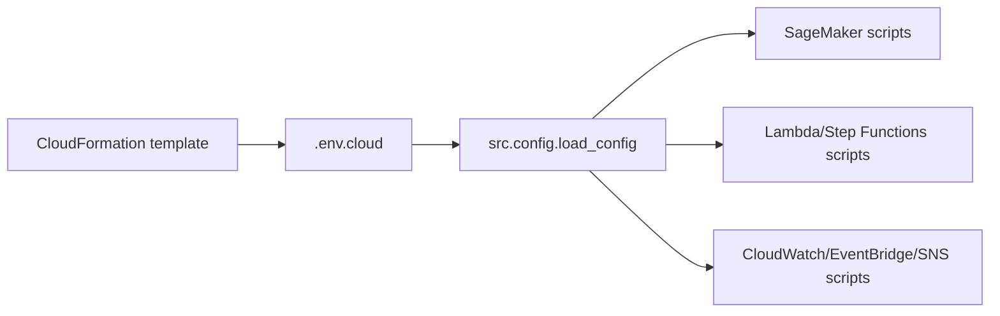

# Infraestructura del laboratorio

Este directorio contiene la infraestructura como codigo base para el laboratorio 5.

## CloudFormation

Archivo principal:

```bash
infra/cloudformation/template.yaml
```

Parametros de ejemplo:

```bash
infra/parameters.example.json
```

## Recursos creados

- Bucket S3 opcional con bloqueo de acceso publico y cifrado SSE-S3.
- SageMaker Execution Role.
- Lambda Execution Role.
- Step Functions Role.
- EventBridge to Step Functions Role.
- SageMaker Model Package Group.

Los endpoints, monitoring schedules, alarms, Lambdas, SNS topics y state machines se crean con los comandos del laboratorio para que cada paso MLOps sea visible y verificable.

El Lambda Execution Role tambien permite iniciar SageMaker Processing Jobs. Esto se usa para el fallback custom de Model Quality: EventBridge invoca una Lambda ligera y esa Lambda crea un Processing Job con nombre unico.

## Relacion con los scripts del laboratorio

| Recurso IaC | Output en `.env.cloud` | Script que lo usa |
|---|---|---|
| Bucket S3 | `S3_BUCKET_NAME` | Casi todos los scripts que escriben datos, artefactos y reportes. |
| SageMaker Execution Role | `SAGEMAKER_EXECUTION_ROLE_ARN` | Pipelines, Processing Jobs, Training Jobs, Endpoints, Model Monitor, Batch Transform. |
| Lambda Execution Role | `LAMBDA_EXECUTION_ROLE_ARN` | `src.create_feedback_loop`, `src.create_custom_model_quality_schedule`. |
| Step Functions Role | `STEPFUNCTIONS_ROLE_ARN` | `src.create_feedback_loop`. |
| EventBridge to SFN Role | `EVENTBRIDGE_TO_SFN_ROLE_ARN` | `src.create_eventbridge_rule`. |
| Model Package Group | `MODEL_PACKAGE_GROUP_NAME` default | `src.create_or_update_pipeline`, `src.register_model_metadata`. |



## Validacion despues del deploy

Ejecuta:

```bash
python -m src.deploy_infra
python -m src.config
python -m src.aws_clients --strict
```

Debes ver valores no vacios para `S3_BUCKET_NAME`, `SAGEMAKER_EXECUTION_ROLE_ARN`, `LAMBDA_EXECUTION_ROLE_ARN`, `STEPFUNCTIONS_ROLE_ARN` y `EVENTBRIDGE_TO_SFN_ROLE_ARN`.

Errores comunes:

- `InsufficientCapabilities`: falta `CAPABILITY_NAMED_IAM`.
- `BucketAlreadyExists`: el nombre de bucket manual ya existe globalmente; usa otro o deja `S3_BUCKET_NAME` vacio.
- `AccessDenied` al crear roles: el usuario no tiene permisos IAM suficientes para CloudFormation.
- Stack en `ROLLBACK_COMPLETE`: vuelve a ejecutar `src.deploy_infra`; el script intenta eliminar stacks fallidos cuando corresponde.

## Despliegue sugerido

```bash
aws cloudformation deploy \
  --template-file infra/cloudformation/template.yaml \
  --stack-name mlops-lab \
  --capabilities CAPABILITY_NAMED_IAM \
  --parameter-overrides ProjectName=mlops-aws Environment=lab ResourcePrefix=mlops-lab CreateBucket=true
```

Despues copiar los outputs a `.env`:

- `S3_BUCKET_NAME`
- `SAGEMAKER_EXECUTION_ROLE_ARN`
- `LAMBDA_EXECUTION_ROLE_ARN`
- `STEPFUNCTIONS_ROLE_ARN`
- `EVENTBRIDGE_TO_SFN_ROLE_ARN`

## Seguridad

El template evita buckets publicos y usa roles especificos por servicio. En ambientes corporativos, reducir aun mas los recursos `*` segun cuenta, region, prefijo y politicas internas.

Los roles estan pensados para laboratorio: privilegios suficientemente amplios para ejecutar la practica completa, pero con nombres y tags estables para auditar y limpiar. En produccion se recomienda acotar permisos por ARN, bucket, prefijo, region y accion exacta.

## Cleanup

Primero ejecutar los comandos del laboratorio:

```bash
make destroy-all
```

Luego eliminar el stack CloudFormation si se desea retirar los roles y el bucket creado por IaC.
