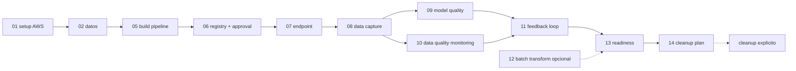

# Guia del laboratorio 5

Esta carpeta documenta los pasos ejecutables del laboratorio **MLOps en AWS - Machine Learning**. Cada archivo `NN_*.md` se relaciona con un comando:

```bash
python -m src.lab_runner step NN
```

Cada documento de paso incluye una lectura conceptual y una seccion operativa con el flujo detallado: script ejecutado, inputs locales, inputs S3/AWS, outputs locales, outputs S3/AWS y proposito. La idea es que puedas entender no solo que comando correr, sino tambien que evidencia queda y que parte del sistema consume cada artefacto.

## Comandos de navegacion

Listar pasos:

```bash
python -m src.lab_runner list
```

Ejecutar un paso individual:

```bash
python -m src.lab_runner step 05
```

Ejecutar el flujo principal sin cleanup, asumiendo que la infraestructura base ya existe o que `.env.cloud` contiene outputs:

```bash
python -m src.lab_runner all
```

Ejecutar la ruta completa con infraestructura base:

```bash
make all-cloud
```

Desplegar solo infraestructura base:

```bash
python -m src.deploy_infra
make deploy-infra
bash scripts/deploy_infra.sh
```

Windows PowerShell:

```powershell
.\scripts\deploy_infra.ps1
```

Ejecutar cleanup explicito:

```bash
python -m src.lab_runner cleanup
```

Ese cleanup elimina recursos AWS del laboratorio y los objetos S3 bajo el prefijo exacto `RESOURCE_PREFIX/ENVIRONMENT`; conserva la evidencia local. Para revisar y borrar archivos locales generados:

```bash
python -m src.cleanup_local_outputs
python -m src.lab_runner cleanup-local
```

Secuencia recomendada al terminar la practica:

```bash
python -m src.lab_runner step 13
python -m src.lab_runner step 14
python -m src.lab_runner cleanup
python -m src.lab_runner cleanup-local
```

## Relacion paso-documento

| Paso | Documento | Comando |
|---|---|---|
| 00 | `00_contexto_negocio.md` | `python -m src.lab_runner step 00` |
| 01 | `01_aws_setup.md` | `python -m src.lab_runner step 01` |
| 02 | `02_standalone_vs_integrated_mode.md` | `python -m src.lab_runner step 02` |
| 03 | `03_devops_vs_mlops.md` | `python -m src.lab_runner step 03` |
| 04 | `04_ci_cd_ct_overview.md` | `python -m src.lab_runner step 04` |
| 05 | `05_sagemaker_pipelines_build.md` | `python -m src.lab_runner step 05` |
| 06 | `06_model_registry_approval_gates.md` | `python -m src.lab_runner step 06` |
| 07 | `07_deployment_pipeline.md` | `python -m src.lab_runner step 07` |
| 08 | `08_data_capture.md` | `python -m src.lab_runner step 08` |
| 09 | `09_model_quality_performance_monitoring.md` | `python -m src.lab_runner step 09` |
| 10 | `10_model_monitor_baseline.md` | `python -m src.lab_runner step 10` |
| 11 | `11_feedback_loop_retraining_rollback.md` | `python -m src.lab_runner step 11` |
| 12 | `12_batch_transform_monitoring.md` | `python -m src.lab_runner step 12` |
| 13 | `13_mlops_readiness_checklist.md` | `python -m src.lab_runner step 13` |
| 14 | `14_cost_security_cleanup.md` | `python -m src.lab_runner step 14` |

## Targets equivalentes

```bash
make list
make step STEP=05
make step-05
make all-cloud
make cleanup
make destroy-local-plan
make destroy-local
```

`all-cloud` ejecuta el despliegue de infraestructura internamente, carga los outputs generados en `.env.cloud` y no destruye recursos al final. El paso 12 de Batch Transform queda opcional para evitar jobs batch adicionales sin pedirlo explicitamente. El cleanup se mantiene como accion explicita.

`cleanup` borra recursos cloud y artefactos S3 del laboratorio, pero no borra `artifacts/local_outputs/` ni `data/local_cache/`; esos archivos quedan como evidencia local. `destroy-local-plan` muestra el alcance y `destroy-local` elimina solo esos archivos generados.

El paso 09 cubre model quality/performance con el flujo nativo de SageMaker Model Quality Monitor, output capture, `InferenceId` y ground truth. Si el schedule nativo falla, tambien prepara un fallback custom con EventBridge, Lambda y SageMaker Processing Job. El paso 10 agrupa Data Quality baseline, monitoring schedule/fallback y alarma. El paso 12 es la ruta opcional de Batch Transform.

## Mapa operativo completo

Este laboratorio esta orquestado por `src/lab_runner.py`. Cada paso es una unidad reproducible: imprime el documento asociado, ejecuta uno o mas modulos Python con `python -m ...` y deja evidencia en `artifacts/local_outputs/`.



## Estructura de carpetas

| Carpeta | Rol en el laboratorio | Ejemplos importantes |
|---|---|---|
| `src/` | Orquestadores cloud, configuracion, validaciones, cleanup y reportes. | `lab_runner.py`, `config.py`, `deploy_model.py`, `create_model_quality_schedule.py`. |
| `processing/` | Codigo que corre dentro de SageMaker Processing Jobs. | `preprocess.py`, `evaluate.py`, `baseline.py`, `custom_model_quality.py`. |
| `training/` | Entrenamiento e inferencia de SageMaker para el modelo standalone. | `train.py`, `inference.py`. |
| `pipelines/build/` | Definicion JSON del SageMaker Pipeline. | `pipeline_definition.py`. |
| `lambdas/` | Handlers usados por Step Functions y fallback custom. | `feedback_handler`, `retraining_trigger`, `custom_model_quality_trigger.py`. |
| `stepfunctions/` | ASL template del feedback loop. | `feedback_loop.asl.json`. |
| `infra/` | CloudFormation base para bucket y roles. | `cloudformation/template.yaml`. |
| `data/local_cache/` | Datos sinteticos y archivos auxiliares generados localmente. | `inference_normal.jsonl`, `model_quality_predictions.jsonl`. |
| `artifacts/local_outputs/` | Evidencia JSON/MD de cada comando. | `pipeline_execution_status.json`, `monitoring_results.json`, `mlops_report.md`. |

## Configuracion central

Las variables se leen en este orden:

1. Variables del entorno del shell.
2. `.env`.
3. `.env.cloud`, generado por `src.deploy_infra`.

`src/config.py` concentra defaults, validaciones y rutas S3. Para cambiar comportamiento, modifica `.env`; evita editar codigo salvo que quieras cambiar la logica del laboratorio.

| Grupo | Variables principales | Impacto |
|---|---|---|
| Identidad AWS | `AWS_PROFILE`, `AWS_REGION` | Perfil y region usados por boto3. |
| Infraestructura | `S3_BUCKET_NAME`, `SAGEMAKER_EXECUTION_ROLE_ARN`, `LAMBDA_EXECUTION_ROLE_ARN`, `STEPFUNCTIONS_ROLE_ARN`, `EVENTBRIDGE_TO_SFN_ROLE_ARN` | Recursos base creados por CloudFormation o provistos manualmente. |
| Nombres | `RESOURCE_PREFIX`, `ENVIRONMENT`, `PIPELINE_NAME`, `MODEL_PACKAGE_GROUP_NAME`, `ENDPOINT_NAME` | Prefijos S3 y nombres de recursos cloud. |
| Compute | `AUTO_SELECT_COMPUTE`, `*_INSTANCE_TYPE_CANDIDATES` | Seleccion de instancias segun Service Quotas. |
| Quality gates | `F1_THRESHOLD`, `AUC_THRESHOLD` | Condiciones para registrar modelos. |
| Monitoreo | `MONITORING_CRON_EXPRESSION`, `MODEL_QUALITY_MONITORING_CRON_EXPRESSION`, `MODEL_MONITOR_IMAGE_URI` | Frecuencia e imagen del analyzer. |
| Alarmas | `ALARM_THRESHOLD`, `MODEL_QUALITY_F1_THRESHOLD`, `ALARM_EMAIL` | Umbrales y destino de notificaciones SNS. |
| Guardrails | `ENABLE_AUTOMATIC_RETRAINING`, `ENABLE_ROLLBACK_EXECUTION`, `ENABLE_BASELINE_UPDATE` | Evitan acciones destructivas o automaticas sin opt-in explicito. |

## Artefactos generados por etapa

| Etapa | Metadata local | Artefactos AWS/S3 |
|---|---|---|
| Setup | `.env.cloud`, `aws_clients` stdout | Stack CloudFormation, bucket, roles. |
| Datos | `data_generation.json`, `data_upload.json` | `s3://.../data/raw/`, `data/processed/` despues del pipeline. |
| Pipeline | `pipeline_upsert.json`, `pipeline_execution.json`, `pipeline_execution_status.json` | SageMaker Pipeline, Processing Jobs, Training Job, Model Package. |
| Registry | `model_registry.json`, `model_approval.json`, `approved_model.json` | Model Package aprobado. |
| Deploy | `endpoint_deployment.json`, `smoke_test.json` | SageMaker Model, EndpointConfig, Endpoint, Data Capture S3. |
| Data Quality | `baseline.json`, `monitoring_schedule.json`, `monitoring_results.json`, `monitoring_report.md` | `statistics.json`, `constraints.json`, schedule/reports. |
| Model Quality | `model_quality_capture.json`, `model_quality_baseline.json`, `model_quality_schedule.json`, `custom_model_quality_*.json` | Ground truth, baseline MQ, schedule nativo o fallback custom, metricas. |
| Alarmas y feedback | `cloudwatch_alarm.json`, `model_quality_alarm.json`, `eventbridge_rule.json`, `feedback_loop.json`, `alarm_notifications.json` | CloudWatch Alarms, SNS topic, EventBridge rule, Step Functions, Lambdas. |
| Cierre | `mlops_report.md`, `readiness_check` stdout, `cleanup_*.json` | Evidencia de readiness y recursos eliminados por cleanup. |

## Reglas de validacion

Despues de cada paso revisa primero `artifacts/local_outputs/`. Si un archivo esperado no existe, el paso probablemente no se ejecuto o fallo antes de escribir metadata. Si existe, revisa los campos `status`, `skipped`, `service_error`, `request_id`, `endpoint_status`, `PipelineExecutionStatus` o `ProcessingJobStatus`.

Validaciones rapidas:

```bash
python -m src.readiness_check
python -m src.mlops_report
python -m src.lab_runner list
```

En AWS, valida en este orden: S3, SageMaker Jobs/Pipelines/Endpoints, CloudWatch Logs/Metrics/Alarms, EventBridge, Step Functions, Lambda y SNS.

## Troubleshooting global

| Sintoma | Causa probable | Accion recomendada |
|---|---|---|
| `Missing required configuration` | `.env.cloud` no existe o `.env` no define bucket/roles. | Ejecuta `python -m src.lab_runner step 01` o completa `.env`. |
| `AccessDenied` con `iam:PassRole` | El usuario o rol no puede pasar el SageMaker execution role. | Revisa politicas IAM y actualiza el stack con `src.deploy_infra`. |
| `ResourceLimitExceeded` o cuota 0 | La instancia elegida no tiene cuota para ese workload. | Ejecuta `python -m src.compute --workload <tipo> --inventory --limit 0` y ajusta candidatos. |
| `InternalFailure` creando schedules | Error del plano de control de SageMaker. | Revisa CloudTrail con el `request_id`; usa fallback custom si aplica. |
| Data Capture no aparece en S3 | Escritura asincrona o endpoint sin captura. | Ejecuta `src.configure_data_capture`, invoca trafico y luego `src.check_data_capture --wait`. |
| No llega email SNS | Suscripcion no confirmada. | Confirma el correo enviado por AWS SNS a `ALARM_EMAIL`. |
| Cleanup no borra S3 | Se ejecuto `--retain-s3-outputs`, el rol no tiene permisos o hay objetos/versiones fuera del prefijo exacto del lab. | Revisa `cleanup_s3_artifacts.json`; confirma `S3_BUCKET_NAME`, `RESOURCE_PREFIX` y `ENVIRONMENT`. |
