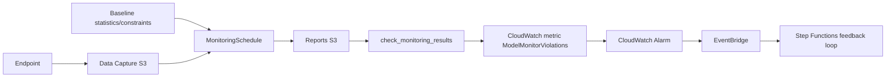

# Monitoring Workflow

The monitoring workflow connects production inference traffic with governed action:

1. Enable Data Capture on the SageMaker Endpoint.
2. Generate baseline statistics and constraints from representative data.
3. Create a Model Monitor schedule with a conservative lab frequency.
4. Send normal traffic and drifted traffic.
5. Inspect `constraints_violations.json` outputs in S3.
6. Publish `ModelMonitorViolations` as a custom CloudWatch metric.
7. Create a CloudWatch alarm for violation count >= 1.
8. Route alarm state changes through EventBridge.
9. Start the Step Functions feedback loop.
10. Decide one controlled action: retraining, rollback, baseline update, human review, or no action.

The workflow does not retrain automatically unless `ENABLE_AUTOMATIC_RETRAINING=true`.

## Implementacion en este repositorio

| Etapa | Script | Entrada | Salida |
|---|---|---|---|
| Data Capture | `src.configure_data_capture`, `src.check_data_capture` | Endpoint `mlops-lab-endpoint` | Capturas `.jsonl` en `s3://.../data-capture/`. |
| Baseline Data Quality | `src.generate_baseline` | `baseline.csv` generado desde datos raw | `statistics.json`, `constraints.json` en `s3://.../monitoring/baseline/`. |
| Schedule Data Quality | `src.create_monitoring_schedule` | Endpoint, baseline, cron | Monitoring schedule o fallback metadata. |
| Drift traffic | `src.simulate_drift` | `data/local_cache/inference_drift.jsonl` | Invocaciones al endpoint y nuevas capturas. |
| Resultados | `src.check_monitoring_results` | Reports de Model Monitor o capturas fallback | `monitoring_results.json`, `monitoring_report.md`, metrica `ModelMonitorViolations`. |
| Alarmas | `src.create_cloudwatch_alarm` | Metrica `MLOps/Lab` | Alarma `mlops-drift-alarm`. |
| Feedback | `src.create_eventbridge_rule`, `src.create_feedback_loop` | Alarmas y Lambdas | EventBridge rule + Step Functions. |

## Flujo de datos

## Validacion y troubleshooting

- Si no hay archivos en Data Capture, ejecuta `python -m src.check_data_capture --wait`.
- Si no hay `statistics.json` o `constraints.json`, ejecuta `python -m src.generate_baseline --wait`.
- Si `CreateMonitoringSchedule` falla con `InternalFailure`, revisa `artifacts/local_outputs/monitoring_schedule.json`; el lab puede continuar con fallback local para publicar la metrica.
- Si CloudWatch no muestra la metrica, ejecuta `python -m src.check_monitoring_results` despues de generar trafico.
- Si EventBridge no invoca Step Functions, valida que `EVENTBRIDGE_TO_SFN_ROLE_ARN` exista en `.env.cloud`.
